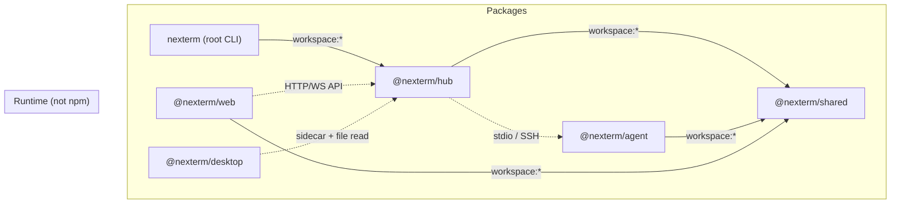
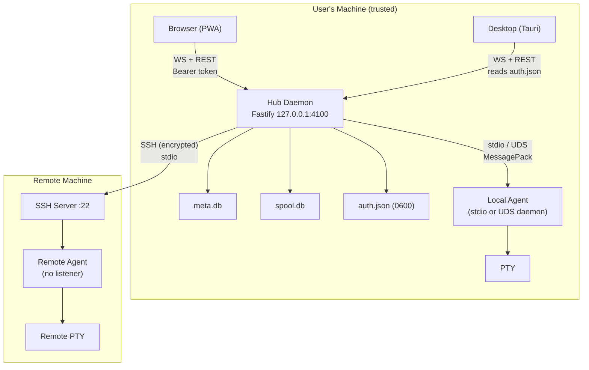
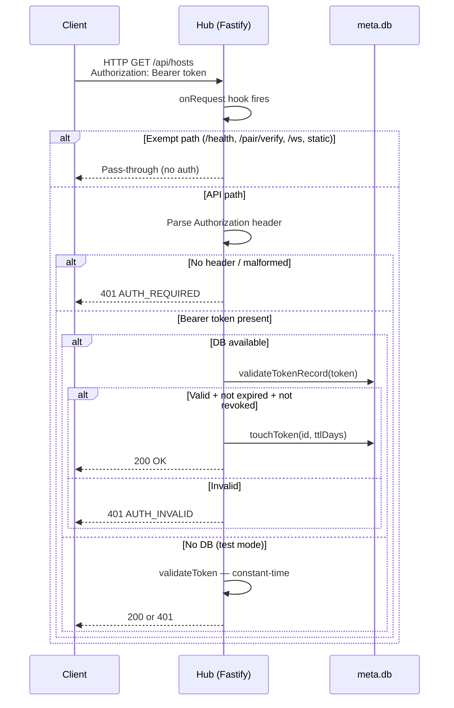
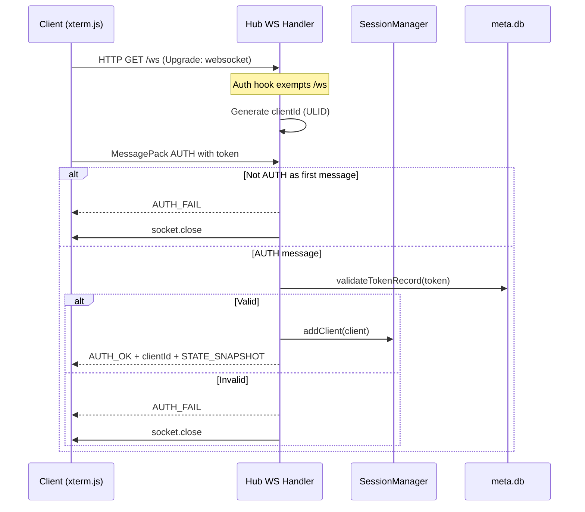
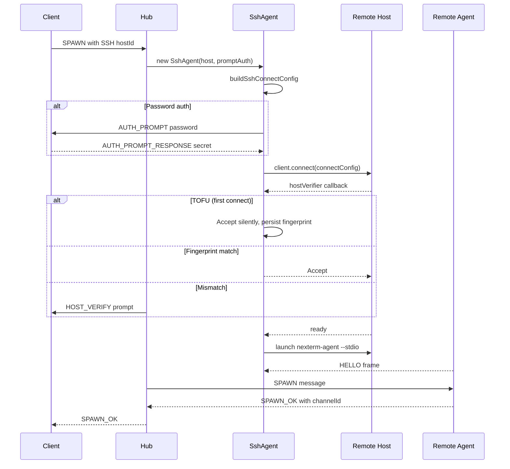
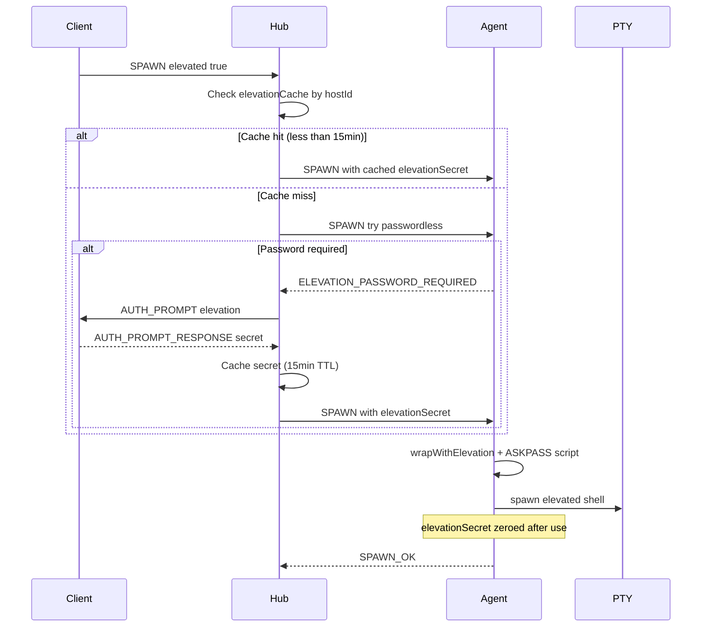
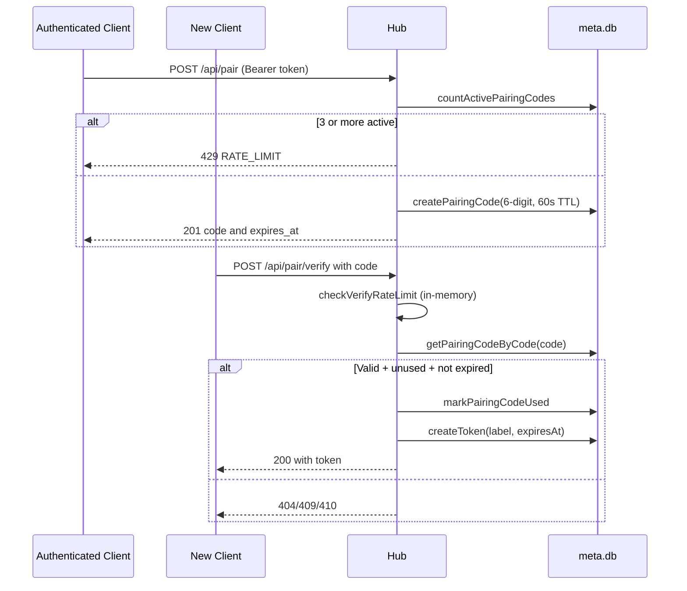
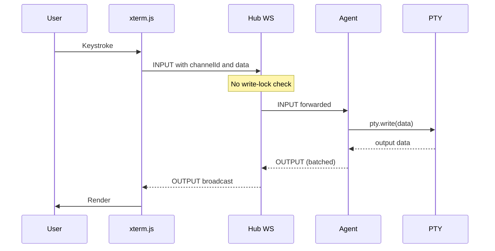
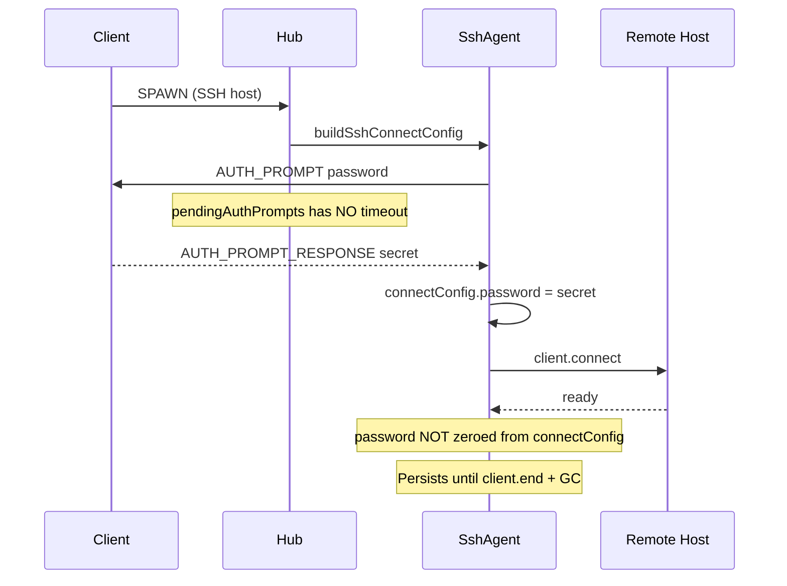

# nexterm — Architecture & Security Audit

> **Project:** nexterm (local-first session terminal platform)
> **Date:** 2026-03-21
> **Revision:** v1.1
> **Scope:** Full audit — all packages (shared, agent, hub, web, desktop) + Rust crates
> **Auditor:** Claude Opus 4.6 (automated, multi-phase)

---

## A. Executive Summary

- **Overall Health: 🟡 NEEDS REMEDIATION** — solid crypto and auth foundations but several defense-in-depth gaps
- 2219 tests passing, 0 failures. Lint and TypeScript strict — both clean
- Token generation is cryptographically sound: 256-bit `crypto.randomBytes`, SHA-256 hashed in DB, constant-time comparison everywhere
- All auth validation paths are **fail-closed** (19 check points audited, 1 intentional fail-open for daemon first-run)
- 1 moderate CVE: Fastify 5.7.4 Content-Type bypass (CVE-2026-3419) — upgrade to ≥5.8.1
- **6 HIGH findings**: WS unauthenticated upgrade, pairing rate-limiter weakness, cross-client credential injection, elevation cache cross-client, remote agent binary shadowing, missing security headers
- **12 MEDIUM findings**: SSH TOFU gaps, deprecated auth path, write-lock bypass, incomplete input validation, unsigned Tauri updates
- **12 LOW findings**: info leakage, DRY violations, edge-case hardening
- No hardcoded secrets, no dangerous dynamic code patterns, no SQL injection, no path traversal
- SQL queries are 100% parameterized (`better-sqlite3 prepare().run()`)
- Auth architecture is fundamentally strong — issues are defense-in-depth gaps, not structural failures

---

## B. Architecture Overview

### B.1 Package Map

| Package | Responsibility | Internal deps | Key external deps | Entry points |
|---------|---------------|---------------|-------------------|--------------|
| `nexterm` (root CLI) | CLI wrapper, spawns hub | `@nexterm/hub` | — | `bin/nexterm.js` |
| `@nexterm/shared` | Wire protocol, types, codec, validation | — | `@msgpack/msgpack`, `ulid` | `src/index.ts` |
| `@nexterm/agent` | PTY manager (local/remote), stdio/daemon modes | `@nexterm/shared` | `node-pty`, `@xterm/headless` | `src/main.ts` |
| `@nexterm/hub` | Central daemon: Fastify, sessions, SSH, SQLite | `@nexterm/shared` | `fastify`, `ssh2`, `better-sqlite3` | `src/main.ts`, `src/cli.ts` |
| `@nexterm/web` | Vue 3 PWA client (embedded in hub) | `@nexterm/shared` | `vue`, `pinia`, `@xterm/xterm` | `src/main.ts` |
| `@nexterm/desktop` | Tauri v2 wrapper (sidecar hub) | — | `@tauri-apps/api` | `src-tauri/src/lib.rs` |

### B.2 Inter-Package Dependencies

**Build order:** `shared` → `agent` + `hub` (parallel) → `web` → `desktop`

### B.3 Trust Boundaries

| Boundary | Trust | Auth mechanism |
|----------|-------|---------------|
| Browser ↔ Hub (localhost WS/REST) | Medium | Bearer token (32-byte hex) |
| Hub ↔ Local Agent (stdio) | High | Process ownership (no auth) |
| Hub ↔ Agent Daemon (UDS) | High | Filesystem permissions (0700 dir) |
| Hub ↔ Remote Agent (SSH) | High | SSH encryption + host key + user auth |
| Agent ↔ PTY | High | Same user on target machine |
| Desktop ↔ Hub | High | Reads auth.json directly (same user) |

### B.4 Architecture Diagram

### B.5 Initialization Order

| # | Component | File | Dependencies met |
|---|-----------|------|-----------------|
| 1 | Platform dirs (XDG) | `main.ts:15` | ✅ |
| 2 | mkdir config + state + logs | `main.ts:17-22` | ✅ |
| 3 | ConfigResolver.loadFromFile | `main.ts:27` | ✅ (dirs ready) |
| 4 | HubLogger init | `main.ts:31` | ✅ (config loaded) |
| 5 | initAuth (auth.json) | `main.ts:33` | ✅ (config dir ready) |
| 6 | openDatabases + migrations | `main.ts:34` | ✅ (state dir ready) |
| 7 | createServer (Fastify + routes) | `main.ts:36` | ✅ (all deps ready) |
| 8 | startServer (bind port) | `main.ts:37` | ✅ |
| 9 | persistRuntime (runtime.json) | `main.ts:43` | ✅ (actual port known) |
| 10 | SIGTERM/SIGINT handlers | `main.ts:70` | ✅ |

**Init order is correct.** Config loaded before logger, auth before server, DB before routes.

### B.6 Architecture Assessment

| Criterion | Status | Observations |
|-----------|--------|--------------|
| Separation of Concerns | ✅ | Clean package boundaries: shared/agent/hub/web/desktop |
| Dependency Inversion | ✅ | Agent behind protocol abstraction, DB behind DAL |
| SOLID | ⚠️ | SessionManager is large (~800 lines), handles multiple concerns |
| DRY | ⚠️ | `loadAuthConfig()` called 3× in createServer; console.log throughout |
| KISS | ✅ | Simple message-based protocol, clear entity model |
| Cohesion/Coupling | ⚠️ | SharedSessionContext is a God object (agents, sessions, channels, cache, prompts) |
| API Design | ✅ | Clean REST + WS separation, consistent error responses |

---

## C. Infrastructure & Deployment

| Aspect | Status | Notes |
|--------|--------|-------|
| CI/CD | ✅ | GitHub Actions: `rust-agent.yml` (3-platform), `release-sea.yml` (5-platform SEA) |
| Containerization | ⚪ | No Dockerfile (not applicable — local-first desktop app) |
| Secrets management | ✅ | auth.json (0600), no .env files, no hardcoded secrets |
| Health check | ✅ | `/api/health` endpoint (unauthenticated) |
| Graceful shutdown | ✅ | SIGTERM/SIGINT handlers close server + sessions |
| Rate limiting | ⚠️ | Only on pairing endpoint, in-memory (see SEC-002) |

---

## D. Dependencies

| Metric | Value |
|--------|-------|
| Total dependencies | 389 |
| Lock file | ✅ pnpm-lock.yaml present |
| Vulnerabilities | 0 critical, 0 high, **1 moderate**, 0 low |
| License | MIT (compatible ecosystem) |
| Dynamic code invocation | None found |

### D.1 Vulnerability

| Package | Current | CVE | Severity | Fix |
|---------|---------|-----|----------|-----|
| fastify | 5.7.4 | CVE-2026-3419 | Moderate (CVSS 5.3) | Upgrade to ≥5.8.1 |

### D.2 Critical Runtime Dependencies

| Package | Version | Role | Status |
|---------|---------|------|--------|
| fastify | 5.7.4 | HTTP/WS server | ⚠️ CVE — upgrade |
| better-sqlite3 | ^11.0.0 | SQLite storage | ✅ |
| ssh2 | ^1.16.0 | SSH transport | ✅ |
| node-pty | ^1.0.0 | PTY management | ✅ |
| @msgpack/msgpack | catalog | Wire codec | ✅ |

---

## E. Security Algorithms & Crypto

| Usage | Algorithm | Baseline | File |
|-------|-----------|----------|------|
| Token generation | `crypto.randomBytes(32)` — 256-bit | ✅ CSPRNG | `hub/src/auth.ts:88` |
| Token storage | SHA-256 hash | ✅ (256-bit random input) | `hub/src/auth.ts:39` |
| Token comparison | `crypto.timingSafeEqual` | ✅ Constant-time | `hub/src/auth.ts:244` |
| Pairing code | `crypto.randomInt(0, 1M)` | ✅ CSPRNG | `hub/src/api/pair.ts:71` |
| SSH fingerprint | SHA-256 digest | ✅ | `hub/src/session/ssh-agent.ts:209` |
| Rust agent auth | `ct_eq` (subtle crate) | ✅ Constant-time | `crates/nexterm-agent/src/daemon.rs:390` |
| Rust elevation secret | `Zeroizing<String>` | ✅ Auto-zeroed on drop | `crates/nexterm-agent/src/handler.rs` |

**No forbidden algorithms found.** No MD5, no SHA-1, no `Math.random()` for security.

---

## F. Critical Paths Analysis

### F.1 Client Authentication Flow

**Files:** `server.ts:98-160`, `auth.ts:230-250`, `cli.ts:70-79`
**Vulnerabilities:** SEC-009 (deprecated fallback skips expiry)

### F.2 WebSocket Connection + AUTH

**Files:** `ws-handler.ts:42-220`, `server.ts:109-115`
**Vulnerabilities:** SEC-001 (no pre-AUTH timeout/limit)

### F.3 Remote Session (SSH)

**Files:** `ssh-agent.ts:71-382`, `session-manager.ts:280-350`
**Vulnerabilities:** SEC-005 (PATH-relative fallback), SEC-008 (silent TOFU), SEC-014 (password not zeroed)

### F.4 Elevation Flow

**Files:** `session-manager.ts:457-602`, `handler.ts:176-225`
**Vulnerabilities:** SEC-004 (cache scoped hostId only)

### F.5 Pairing Flow

**Files:** `pair.ts:52-144`
**Vulnerabilities:** SEC-002 (rate limiter), SEC-011 (code entropy)

### F.6 Terminal I/O Flow

**Files:** `ws-handler.ts:165`, `session-manager.ts:732-739`, `handler.ts:453-464`
**Vulnerabilities:** SEC-010 (INPUT bypasses write-lock)

### F.7 SSH Credential Handling

**Files:** `ssh-agent.ts:71-128`, `channel-lifecycle-manager.ts:885-898`
**Vulnerabilities:** SEC-014 (not zeroed), SEC-015 (no prompt timeout)

### Diagrams Attestation

| Critical Path | Diagram | Files referenced |
|---------------|---------|-----------------|
| Client Authentication | ✅ | 3 files |
| WebSocket AUTH | ✅ | 2 files |
| Remote Session (SSH) | ✅ | 3 files |
| Elevation Flow | ✅ | 2 files |
| Pairing Flow | ✅ | 1 file |
| Terminal I/O | ✅ | 3 files |
| SSH Credential Handling | ✅ | 2 files |

**7/7 critical paths diagrammed.**

---

## G. Feature Analysis

### Auth System
- **Well done:** ✅ 256-bit token, SHA-256 hash storage, constant-time comparison, sliding-window TTL, revocation support, DB-backed token management API, pairing codes with single-use + expiry
- **Needs improvement:** ⚠️ Deprecated `validateToken` still in production (skips expiry/revocation), initAuth no format validation, auth.json write-then-chmod race

### Session Management
- **Well done:** ✅ Clean entity model (Host→Session→Channel), agent abstraction (Local/Daemon/SSH), reconnection support, daemon PTY survival
- **Needs improvement:** ⚠️ SharedSessionContext is a large shared object, elevation cache cross-client, pendingAuthPrompts race conditions

### SSH Transport
- **Well done:** ✅ Supports key/password/agent auth, host key verification, auto-deploy agent binary
- **Needs improvement:** ⚠️ TOFU silent on first connect, trust_once=trust_permanent, password not zeroed, PATH fallback on deploy failure

### Web UI
- **Well done:** ✅ Vue 3 Composition API, Pinia stores, xterm.js integration, theming, responsive
- **Needs improvement:** ⚠️ Dead composables (useLogs, useTerminal), disconnect not implemented, pane focus not wired

---

## H. Technical Debt

### H.1 Deprecated Code

| Item | File | Still used | Migration plan |
|------|------|-----------|----------------|
| `validateToken` | `auth.ts:235` | **YES** — `server.ts:152`, `ws-handler.ts:129` | Ensure DB always provided; replace with `validateTokenRecord`; delete |

### H.2 TODO/FIXME Items (security-relevant)

| Item | File | Priority |
|------|------|----------|
| ~~AUTH_PROMPT_RESPONSE clientId verification~~ | ~~`session-manager.ts:753`~~ | ✅ Resolved (SEC-003) |
| SSH TOFU trust_once vs trust_permanent | `session-manager.ts:757` | P1 |
| Wallpaper upload MIME validation | `wallpapers.ts:57` | P1 |
| SSH reconnect missing promptAuth | `agent-connection-manager.ts` | P1 |
| Tauri updater signing key | `tauri.conf.json` | P1 |

### H.3 Dead Code

| Symbol | File | Reason |
|--------|------|--------|
| `useLogs` composable | `web/src/composables/useLogs.ts` | Orphan — not imported |
| `useTerminal` composable | `web/src/composables/useTerminal.ts` | Orphan — not imported |
| `LOG_SEVERITY` | `hub/src/logging/index.ts` | No cross-file callers |
| Legacy DAL methods | `hub/src/dal/` | Superseded by typed variants |

---

## I. Security Findings

### I.1 OWASP Top 10:2025 Assessment

| # | Category | Status | Key evidence |
|---|----------|--------|--------------|
| A01 | Broken Access Control | ⚠️ | ~~WS auth bypass at HTTP level~~ ✅ SEC-001, INPUT bypasses write-lock, ~~AUTH_PROMPT_RESPONSE no clientId check~~ ✅ SEC-003 |
| A02 | Security Misconfiguration | ⚠️ | ~~No security headers~~ ✅ SEC-006 (helmet added), CORS wildcard localhost remains |
| A03 | Supply Chain | ✅ | No dynamic code invocation, lock file present, ~~1 moderate CVE (Fastify)~~ ✅ SEC-021 upgraded |
| A04 | Cryptographic Failures | ✅ | All crypto sound: CSPRNG, SHA-256, timingSafeEqual, ct_eq |
| A05 | Injection | ✅ | All SQL parameterized, path traversal prevented, shell metachar regex (incomplete but node-pty mitigates) |
| A06 | Insecure Design | ⚠️ | Pairing rate limiter in-memory only, no general API rate limiting |
| A07 | Authentication Failures | ⚠️ | Deprecated auth path in production, pairing code low entropy, elevation cache cross-client |
| A08 | Data Integrity | ✅ | MessagePack decode guarded, frame size limits, structured error responses |
| A09 | Logging Failures | ⚠️ | ~80+ console.log in production without log-level gating, sensitive context exposed |
| A10 | Exception Handling | ✅ | All error handlers fail-closed, no stack traces in API responses |

### I.2 Security Headers

| Header | Present | Recommendation |
|--------|---------|----------------|
| Content-Security-Policy | ✅ | Added via `@fastify/helmet` (2026-03-22) — strict CSP: default/script 'self', style 'unsafe-inline', connect ws:/wss: |
| X-Content-Type-Options | ✅ | `nosniff` — set by helmet |
| X-Frame-Options | ✅ | `SAMEORIGIN` — set by helmet |
| Referrer-Policy | ✅ | Set by helmet |
| Permissions-Policy | ❌ | Not set by helmet defaults — configure explicitly |

### I.3 Fail-Open Analysis

**19 authentication check points audited. Results: 18 fail-closed, 1 intentional fail-open.**

The single fail-open is the Rust daemon's first-run mode (`daemon.rs:306`): when `auth.json` does not exist, connections are accepted without authentication. This is intentional for initial setup but creates a risk if `auth.json` is deleted post-setup (SEC-024).

### I.4 Consolidated Findings Table

| ID | Severity | Category | Location | Issue | Remediation |
|----|----------|----------|----------|-------|-------------|
| ~~SEC-001~~ | ~~**HIGH**~~ | ~~A01~~ | ~~`server.ts:117`, `ws-handler.ts:68`~~ | ~~WS `/ws` bypasses HTTP auth, no idle timeout on unauthenticated connections — enables DoS via connection flood~~ | ✅ **RESOLVED** (2026-03-22) — 10s `authTimeout` added in `ws-handler.ts`, cleared on AUTH success or socket close |
| SEC-002 | **HIGH** | A07 | `pair.ts:28-42` | Pairing rate limiter: in-memory global counter, not per-IP, resets on hub restart — brute-force of 6-digit code possible with timed restart | Persist rate-limit state to DB; make per-IP; add exponential backoff |
| ~~SEC-003~~ | ~~**HIGH**~~ | ~~A01~~ | ~~`session-manager.ts:753`, `channel-lifecycle-manager.ts:885`~~ | ~~AUTH_PROMPT_RESPONSE: no clientId verification — any authenticated WS client can inject credentials into another client's pending SSH prompt~~ | ✅ **RESOLVED** (2026-03-22) — `pending.clientId !== clientId` check added in `ssh-connection-manager.ts` + test |
| SEC-004 | **HIGH** | A07 | `session-manager.ts:547` | Elevation secret cache keyed by hostId only (not clientId) — shared across all WS clients for 15 minutes | Scope cache to `(hostId, clientId)` pair; reduce TTL to 5min or less |
| SEC-005 | **HIGH** | A08 | `ssh-agent.ts:359`, `session-manager.ts:363` | Remote agent binary falls back to PATH-relative `nexterm-agent` when deploy fails — compromised remote host can shadow with malicious binary | Use absolute path from deploy only; reject connection if deploy fails and no absolute path known |
| ~~SEC-006~~ | ~~**HIGH**~~ | ~~A02~~ | ~~`server.ts:59`~~ | ~~No security response headers set (CSP, X-Content-Type-Options, X-Frame-Options, Referrer-Policy)~~ | ✅ **RESOLVED** (2026-03-22) — `@fastify/helmet@12` registered with strict CSP in `server.ts` |
| SEC-007 | MEDIUM | A04 | `auth.ts:82-95` | auth.json stores plaintext token; writeFileSync then chmodSync creates brief world-readable window on first write | Use atomic write with umask 0077; consider storing hash only |
| SEC-008 | MEDIUM | A07 | `ssh-agent.ts:209`, `session-manager.ts:757` | SSH TOFU: first connection silently trusted without user confirmation; `trust_once` behaves identically to `trust_permanent` (both persist fingerprint) | Prompt user on TOFU; implement session-scoped ephemeral fingerprint for trust_once |
| SEC-009 | MEDIUM | A07 | `auth.ts:235` | `validateToken` is @deprecated but called in `server.ts:152` and `ws-handler.ts:129` as no-DB fallback — skips token expiry and revocation checks | Always inject DB; remove deprecated fallback; delete function |
| SEC-010 | MEDIUM | A01 | `ws-handler.ts:165`, `session-manager.ts:732` | INPUT messages bypass write-lock check — any authenticated client can send keystrokes to any channel regardless of write-lock state | Verify clientId holds write-lock for channelId before forwarding INPUT to agent |
| SEC-011 | MEDIUM | A07 | `pair.ts:71` | Pairing code is 6 decimal digits (~20 bits entropy); combined with SEC-002 rate-limiter weakness, brute-force probability is non-trivial | Increase to 8+ digits or alphanumeric; persist rate limit |
| SEC-012 | MEDIUM | A05 | `launch-profiles.ts:14`, `spawn.ts:22` | Shell field: SPAWN handler validates length only; launch-profiles SHELL_META_RE blocks limited metachar set (missing newline, redirectors, parens) | Validate as absolute path; apply strict allowlist matching validateCustomCommand pattern |
| SEC-013 | MEDIUM | A05 | `wallpapers.ts:57` | Wallpaper upload validates extension only, no magic-byte MIME check, no file-size quota enforcement beyond multipart limit | Add magic-byte validation (e.g. `file-type` library); enforce per-file size limit |
| SEC-014 | MEDIUM | A04 | `ssh-agent.ts:89` | SSH password stored as plain string in ssh2 ConnectConfig — not zeroed after ready event; persists until client.end + GC | Zero `connectConfig.password = ''` immediately after ssh2 ready event |
| SEC-015 | MEDIUM | A01 | `channel-lifecycle-manager.ts:895` | pendingAuthPrompts: no server-side timeout (timer: null); concurrent SPAWNs for same hostId overwrite existing resolve (orphaned promise) | Always set 60s timeout; use Map of arrays to queue concurrent prompts |
| SEC-016 | MEDIUM | A02 | `pty.ts:37` | Agent merges process.env with hub-supplied env into PTY — hub env vars (AWS, tokens) leak to PTY processes | Use clean environment from login shell; only allow-listed vars from hub |
| SEC-017 | MEDIUM | A08 | `tauri.conf.json` | Tauri auto-updater signing key not generated — update payloads cannot be cryptographically verified | Generate signing key via `tauri signer generate`; set `updater.pubkey` |
| SEC-018 | MEDIUM | A09 | `spawn.ts:8`, `session-manager.ts`, `local-agent.ts` | ~80+ console.log calls in production paths expose hostId, clientId, shell paths, stack traces without log-level gating | Replace with hubLogger at debug level; gate behind LOG_LEVEL config |
| SEC-019 | LOW | A07 | `auth.ts:82` | initAuth reads token from auth.json without format validation (Tauri client validates 64-char hex; hub does not) | Add `/^[0-9a-f]{64}$/` validation in initAuth |
| SEC-020 | LOW | A02 | `config.ts:533` | Default CORS origins include `http://localhost:*` — any local service on any port is a trusted origin | Narrow default to ports 4100-4199; document risk for shared machines |
| ~~SEC-021~~ | ~~LOW~~ | ~~A03~~ | ~~`pnpm-workspace.yaml:22`~~ | ~~Fastify 5.7.4: CVE-2026-3419 Content-Type validation bypass (CVSS 5.3)~~ | ✅ **RESOLVED** (2026-03-22) — fastify upgraded to `^5.8.1` (resolved to 5.8.2) |
| SEC-022 | LOW | A01 | `server.ts:117` | /api/fonts auth bypass is method-agnostic — if POST font upload added, it would inherit bypass | Restrict bypass to GET method only (like wallpapers) |
| SEC-023 | LOW | A02 | `main.ts:13` | NEXTERM_PORT env var parsed without range validation (float, >65535 accepted) | Validate as integer in [1, 65535] |
| SEC-024 | LOW | A07 | `daemon.rs:306` | Rust daemon accepts connections without auth if auth.json deleted post-setup (no sentinel for "auth was configured") | Write sentinel flag after first auth setup; treat missing auth.json post-sentinel as error |
| SEC-025 | LOW | A02 | `tauri.conf.json` | CSP fully disabled in Desktop/Tauri — XSS in webview has unrestricted Tauri IPC access | Add permissive CSP allowing tauri:// IPC but blocking unsafe-inline scripts |
| SEC-026 | LOW | A01 | `server.ts:112` | Static assets (UI) served unauthenticated — reveals app presence and build metadata | Document as intentional; add optional config flag for auth on static assets |
| SEC-027 | LOW | DRY | `server.ts:89,233,250` | loadAuthConfig called 3 times in createServer — minor TOCTOU if config changes between reads | Load once at top; pass to all call sites |
| SEC-028 | LOW | A09 | `ssh-agent.ts:359` | SSH agent stderr logged as info without sanitization — ANSI escape/log injection from malicious remote binary | Sanitize/strip ANSI codes before logging |
| SEC-029 | LOW | A05 | `pair.ts:22` | /api/pair/verify body not validated by Fastify JSON schema — framework-level rejection not enforced | Add Fastify body schema for 6-digit code validation |
| SEC-030 | LOW | A09 | `server.ts:148` | touchToken errors silently swallowed — impossible to audit token usage | Wrap in try/catch, log at warn level |

**Summary: 6 HIGH, 12 MEDIUM, 12 LOW — 30 total findings. (4 resolved as of 2026-03-22)**

---

## J. Tool Run Results

| Tool | Result | Actions |
|------|--------|---------|
| Unit tests | **2220 pass** / 0 fail / 10 skip | ✅ Clean (+1 SEC-003 test) |
| Lint (Biome) | 0 errors, 0 warnings | ✅ Clean |
| TypeScript strict | 0 errors | ✅ Clean |
| pnpm audit | ~~1 moderate (Fastify CVE-2026-3419)~~ | ✅ Resolved — fastify upgraded to 5.8.2 |
| Secrets scan | No hardcoded secrets found | ✅ Clean |
| .gitignore | Covers .env, auth.json | ✅ Proper |

---

## K. Action Plan

### K.1 P0 — Critical ✅ ALL RESOLVED (2026-03-22)

| ID | Issue | Fix | Status |
|----|-------|-----|--------|
| ~~SEC-003~~ | ~~AUTH_PROMPT_RESPONSE credential injection~~ | ~~Add clientId check in resolver~~ | ✅ `b605745` |
| ~~SEC-001~~ | ~~WS unauthenticated connection flood~~ | ~~Add 5-10s idle timeout for pre-AUTH sockets~~ | ✅ `b605745` |
| ~~SEC-006~~ | ~~Missing security headers~~ | ~~Register `@fastify/helmet`~~ | ✅ `b605745` |
| ~~SEC-021~~ | ~~Fastify CVE-2026-3419~~ | ~~Upgrade catalog to `^5.8.1`~~ | ✅ `b605745` |

### K.2 P1 — High (fix this sprint)

| ID | Issue | Fix | Effort |
|----|-------|-----|--------|
| SEC-002 | Pairing rate limiter weakness | Persist to DB, per-IP counter | M (4h) |
| SEC-004 | Elevation cache cross-client | Scope to (hostId, clientId) | S (2h) |
| SEC-005 | Remote agent PATH fallback | Reject if no absolute path | S (1h) |
| SEC-009 | Deprecated validateToken in production | Always inject DB, remove fallback | S (2h) |
| SEC-010 | INPUT bypasses write-lock | Add clientId write-lock check | S (2h) |
| SEC-008 | SSH TOFU silent + trust_once | Prompt on TOFU, differentiate trust_once | M (4h) |

### K.3 P2 — Medium (plan for next cycle)

| ID | Issue | Fix | Effort |
|----|-------|-----|--------|
| SEC-007 | auth.json write race | Atomic write with umask | S (2h) |
| SEC-011 | Pairing code entropy | Increase to 8+ digits | S (1h) |
| SEC-012 | Shell field validation | Absolute path validation | S (2h) |
| SEC-013 | Wallpaper MIME validation | Add magic-byte check | M (3h) |
| SEC-014 | SSH password not zeroed | Zero after ready event | S (1h) |
| SEC-015 | Pending prompt timeout + race | Add 60s timeout, queue concurrent | M (3h) |
| SEC-016 | process.env inheritance | Clean env for PTY | M (3h) |
| SEC-017 | Tauri updater unsigned | Generate signing key | S (1h) |
| SEC-018 | console.log in production | Replace with hubLogger | M (4h) |

### K.4 Quick Wins (under 90 min each)

| ID | Fix | Effort |
|----|-----|--------|
| ~~SEC-021~~ | ~~pnpm-workspace.yaml: fastify `^5.0.0` to `^5.8.1`~~ | ✅ Done |
| ~~SEC-006~~ | ~~`pnpm add @fastify/helmet` + register in server.ts~~ | ✅ Done |
| SEC-019 | Add hex validation in initAuth | 15min |
| SEC-022 | Add method check to /api/fonts bypass | 5min |
| SEC-023 | Validate NEXTERM_PORT as int in [1, 65535] | 10min |
| SEC-029 | Add Fastify body schema to /api/pair/verify | 15min |
| SEC-030 | Wrap touchToken in try/catch with warn log | 10min |

---

## L. Tracking Summary

| Category | 🔴 Open | 🟡 In Progress | ✅ Resolved | ⚪ Obsolete | 🔵 Deferred |
|----------|---------|----------------|-------------|-------------|-------------|
| Architecture | 4 | 0 | 1 | 0 | 0 |
| Auth/AuthZ | 6 | 0 | 2 | 0 | 0 |
| Crypto | 2 | 0 | 0 | 0 | 0 |
| Dependencies | 0 | 0 | 1 | 0 | 0 |
| Input Validation | 4 | 0 | 0 | 0 | 0 |
| Logging | 3 | 0 | 0 | 0 | 0 |
| Infrastructure | 4 | 0 | 0 | 0 | 0 |
| Tech Debt | 3 | 0 | 0 | 0 | 0 |
| **Total** | **26** | **0** | **4** | **0** | **0** |

---

## Attestation

### Package Coverage

| Package | Analyzed | Files read | Findings |
|---------|----------|------------|----------|
| `@nexterm/shared` | ✅ | 4 | 0 |
| `@nexterm/agent` | ✅ | 18 | 2 |
| `@nexterm/hub` | ✅ | 123 | 25 |
| `@nexterm/web` | ✅ | 135 | 2 |
| `@nexterm/desktop` | ✅ | 2 | 3 |
| `nexterm` (root) | ✅ | 3 | 0 |
| Rust crates | ✅ | N/A | 2 |

**Existing packages not analyzed: None**

### Critical Path Sequence Diagrams

| Critical Path | Diagram | Files |
|---------------|---------|-------|
| Client Authentication | ✅ | 3 |
| WebSocket AUTH | ✅ | 2 |
| Remote Session (SSH) | ✅ | 3 |
| Elevation Flow | ✅ | 2 |
| Pairing Flow | ✅ | 1 |
| Terminal I/O | ✅ | 3 |
| SSH Credential Handling | ✅ | 2 |

**Total: 7/7 diagrammed**

### Inter-Package Diagram

| Diagram | Produced |
|---------|----------|
| Package dependency graph | ✅ |
| Interactions table with build order | ✅ |
| Trust boundaries identified | ✅ |

### Deprecated Code

| Item | Status |
|------|--------|
| @deprecated scan run | ✅ |
| Deprecated items listed | 1 item |
| Items with migration plan | 1/1 |
| Items without plan in findings | ✅ (SEC-009) |

### Sections Analyzed

| Section | Analyzed | Proofs |
|---------|----------|--------|
| Project Scoping | ✅ | ✅ |
| Architecture | ✅ | ✅ |
| Infrastructure | ✅ | ✅ |
| Dependencies | ✅ | ✅ |
| Inter-packages | ✅ | ✅ |
| Crypto/Security | ✅ | ✅ |
| Critical paths | ✅ | ✅ |
| Features | ✅ | ✅ |
| Patterns | ✅ | ✅ |
| Debt/Deprecated | ✅ | ✅ |
| OWASP | ✅ | ✅ |
| Project tools | ✅ | ✅ |

**Sections copied from existing report: None (first audit)**

---

## Changelog

| Date | Revision | Changes |
|------|----------|---------|
| 2026-03-21 | v1.0 | Initial full audit — all packages, 30 findings, 7 critical paths |
| 2026-03-22 | v1.1 | P0 remediation: SEC-001 (WS timeout), SEC-003 (clientId check), SEC-006 (helmet), SEC-021 (fastify upgrade). Catalog hygiene: 3 deps migrated. 4/30 findings resolved |
