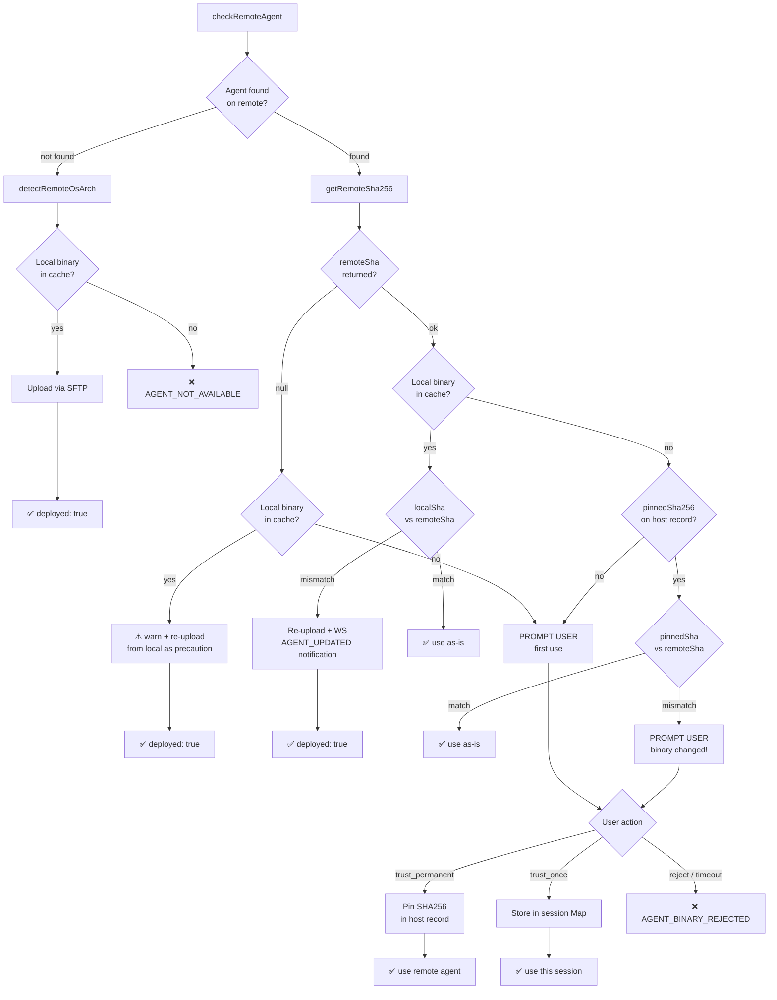
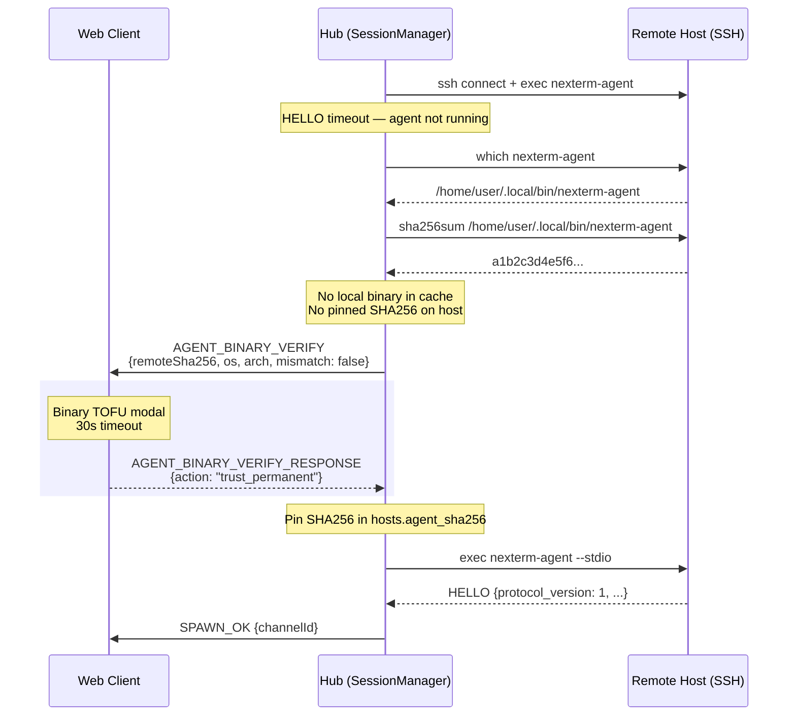

# Remote Agent Auto-Deploy — Design Spec

**Date:** 2026-03-24
**Status:** Draft (rev 2 — post-review fixes)
**Scope:** Wire auto-deploy in SSH flow, SHA256 integrity check, binary TOFU, UX error modal, aarch64 CI target

---

## Problem

Remote terminals cannot be opened because:

1. `deployOptions` is never passed to `SshAgent` in `SessionManager.handleSpawn()` — auto-deploy code exists but is dead
2. No binary in the local cache (`~/.local/state/nexterm/binaries/`) — even if deploy is wired, nothing to upload
3. No CI target for `aarch64-unknown-linux-gnu` (Raspberry Pi)
4. No UX feedback when agent is unavailable — user sees a cryptic timeout
5. No version/integrity verification — stale or tampered remote binaries go undetected

## Design

### 1. Wire `deployOptions` in `handleSpawn`

Always pass `deployOptions` when creating `SshAgent` for SSH hosts:

```typescript
const deployOpts: SshAgentDeployOptions = {
  binaryCache: getBinaryCacheDir(),
  onOsDetected: (hostId, os, arch) => {
    this.ctx.metaDal.updateHostOsArch(hostId, os, arch);  // already exists in DAL
  },
  promptBinaryVerify: this.sshMgr.buildBinaryVerifyPrompt(client),
};
const sshAgent = new SshAgent(host, promptAuth, deployOpts);
```

Both initial and TOFU-retry `SshAgent` instances get `deployOptions`.
`promptBinaryVerify` is part of `SshAgentDeployOptions` (same DI pattern as `onOsDetected`).

### 2. SHA256 integrity check

New function in `agent-deployer.ts`:

```typescript
async function getRemoteSha256(
  client: SshClient,
  remotePath: string,
  os: HostOs,
): Promise<string | null>
```

- Unix: `sha256sum <remotePath>` → parse first 64 hex chars
- Windows: `powershell -c "(Get-FileHash '<remotePath>' -Algorithm SHA256).Hash.ToLower()"` → single clean line
- Returns lowercase hex digest, or `null` on failure (command not found, permission denied, etc.)

Local hash: `crypto.createHash("sha256").update(readFileSync(localPath)).digest("hex")`

### 3. Binary TOFU — per-host SHA256 pinning

**Security model**: the local binary cache is a trusted source (populated only by CI artifacts, GitHub Releases, or manual placement). Remote binaries of unknown provenance are NEVER downloaded into the shared cache. Instead, their SHA256 is pinned per-host.



**trust_permanent**: stores the remote agent's SHA256 in the host record (`hosts.agent_sha256` in meta.db). Does NOT download to shared cache. On next connect, the pinned hash is the baseline.

**trust_once**: uses the remote agent for this hub process lifetime. Stored in `ctx.trustedAgentSha256: Map<hostId, string>` (analogous to `ctx.trustedOnceFingerprints`). Cleared on hub restart. Survives SSH reconnects within the same process.

**reject**: aborts the SSH connection. Sends `AGENT_BINARY_REJECTED` error to client.

### 4. Protocol changes

New WS error codes (reuse existing `ERROR` message type):

| Code | When | UI behavior |
|------|------|-------------|
| `AGENT_NOT_AVAILABLE` | Agent not found + deploy failed (no binary in cache) | Deploy-failed modal |
| `AGENT_BINARY_REJECTED` | User rejected untrusted binary | Toast notification |
| `AGENT_UPDATED` | Remote agent was re-uploaded (SHA256 mismatch) | Info notification |

New WS message for binary TOFU prompt (follows same pattern as `HOST_KEY_VERIFY`):

```typescript
// Hub → Client
interface AgentBinaryVerifyMessage {
  type: "AGENT_BINARY_VERIFY";
  promptId: string;
  hostId: string;
  hostname: string;
  remotePath: string;
  remoteSha256: string;
  os: HostOs;
  arch: HostArch;
  mismatch: boolean;           // true if SHA256 changed vs pinned value
  pinnedSha256?: string;       // previous value (only when mismatch=true)
}

// Client → Hub
interface AgentBinaryVerifyResponseMessage {
  type: "AGENT_BINARY_VERIFY_RESPONSE";
  promptId: string;
  action: "trust_permanent" | "trust_once" | "reject";
}
```

**Timeout**: 30 seconds (matches `HOST_KEY_VERIFY`). Default action on timeout: `reject`.

#### Binary TOFU sequence diagram



### 5. Updated `deployAgentIfNeeded` flow

`promptBinaryVerify` is passed via `SshAgentDeployOptions` (not as a separate parameter):

```typescript
interface SshAgentDeployOptions {
  binaryCache: string;
  onOsDetected?: (hostId: string, os: HostOs, arch: HostArch) => void;
  promptBinaryVerify?: BinaryVerifyPromptFn;     // NEW
  pinnedSha256?: string | null;                   // NEW — from host record
}
```

Pseudocode:

```
1. existingPath = checkRemoteAgent(client)

2. IF existingPath found:
   a. Detect OS/arch (needed for binary naming even if already on remote)
   b. remoteSha = getRemoteSha256(client, existingPath, os)

   c. IF remoteSha is null:
      — Cannot verify integrity. If localBinary exists, re-upload as precaution
        with warn log. If no local binary, fall through to TOFU (step 2e).

   d. IF localBinary in cache exists:
      localSha = sha256(localBinary)
      IF remoteSha === localSha → return { deployed: false, remotePath }
      ELSE → re-upload + log warn + send AGENT_UPDATED notification
             return { deployed: true, remotePath }

   e. ELSE (no local binary in cache):
      — Check per-host pin: pinnedSha256 from deploy options
      IF pinnedSha256 exists AND remoteSha === pinnedSha256:
        → return { deployed: false, remotePath }  (pinned, matches)
      IF pinnedSha256 exists AND remoteSha !== pinnedSha256:
        → PROMPT USER with mismatch=true (binary changed vs pin!)
      IF no pin:
        → PROMPT USER with mismatch=false (first use)

      IF no promptBinaryVerify function:
        → throw new Error("AGENT_BINARY_UNTRUSTED")  (safe default)

      action = await promptBinaryVerify(...)
      IF trust_permanent → return { ..., pinSha256: remoteSha }
      IF trust_once → return { ..., trustOnce: true }
      IF reject → throw new Error("AGENT_BINARY_REJECTED")

3. IF not found:
   a. detectRemoteOsArch (or use host record values)
   b. localBinary = findLocalBinary(binaryCache, os, arch)
   c. IF localBinary exists → upload → return { deployed: true, remotePath }
   d. ELSE → throw new Error("AGENT_NOT_AVAILABLE")
```

### 6. Error propagation in `SshAgent.start()`

The existing catch block in `SshAgent.start()` must distinguish error types:

| Error | Behavior |
|-------|----------|
| `AGENT_BINARY_REJECTED` | Propagate to caller (user decision) — NO fallback |
| `AGENT_BINARY_UNTRUSTED` | Propagate to caller — NO fallback |
| `AGENT_NOT_AVAILABLE` | Propagate to caller — NO fallback |
| Infrastructure errors (SFTP fail, upload fail) | Fall back to `nexterm-agent --stdio` (best-effort, existing behavior) |

Implementation: check `err.message` for known codes before falling through to the generic catch.

### 7. UX — Error modal (agent not available)

Displayed when error code is `AGENT_NOT_AVAILABLE`.

**Content:**
- Warning icon + title: "Remote Agent Not Available"
- Body: "The nexterm agent was not found on **{hostname}** and could not be deployed automatically."
- Reason detail: "No pre-built binary for {os}/{arch} found in the local cache."
- Help text: "To resolve this, either:
  - Install the agent manually on the remote host (ensure `nexterm-agent` is in the PATH)
  - Place the pre-built binary in the local cache for automatic deployment"
- **Retry** button (re-triggers SPAWN → re-triggers deploy check)
- **Close** button

### 8. UX — Binary TOFU modal

Displayed when receiving `AGENT_BINARY_VERIFY` message.

**First use (mismatch=false):**
- Shield icon + title: "Verify Remote Agent"
- Body: "An agent binary was found on **{hostname}** at `{remotePath}`, but its identity cannot be verified."
- SHA256 fingerprint display: `SHA256: a1b2c3d4...` (monospace, full hash visible)
- OS/Arch badge: `linux / arm64`
- Three buttons:
  - **Trust Permanently** — "Pin this fingerprint for future connections"
  - **Trust Once** — "Use for this session only"
  - **Reject** — "Do not connect"

**SHA256 changed (mismatch=true):**
- Warning icon (orange) + title: "Remote Agent Changed"
- Body: "The agent binary on **{hostname}** has changed since it was last verified."
- Old SHA256 vs New SHA256 display (side by side or stacked, monospace)
- Same three buttons but **Trust Permanently** updates the pin

**Timeout**: 30s countdown shown in modal. On timeout → auto-reject.

### 9. DB schema change

Add `agent_sha256` column to `hosts` table:

```sql
ALTER TABLE hosts ADD COLUMN agent_sha256 TEXT DEFAULT NULL;
```

Migration number: next available (013). Nullable — `null` means no pin (unverified or cache-managed).

### 10. CI — aarch64-unknown-linux-gnu target

Add to `.github/build-matrix.json`:

```json
{
  "triple": "aarch64-unknown-linux-gnu",
  "runner": "ubuntu-latest",
  "os": "linux",
  "arch": "arm64",
  "shell_sh": true,
  "agent": true,
  "hub": false,
  "desktop": false,
  "enabled": true
}
```

Cross-compile requirements (already documented):
- `sudo apt-get install gcc-aarch64-linux-gnu`
- `CARGO_TARGET_AARCH64_UNKNOWN_LINUX_GNU_LINKER=aarch64-linux-gnu-gcc`
- Add `aarch64-unknown-linux-gnu` to Rust toolchain targets

---

## Files to create/modify

| File | Change |
|------|--------|
| `packages/hub/src/session/agent-deployer.ts` | SHA256 verify, binary TOFU flow, per-host pinning |
| `packages/hub/src/session/ssh-agent.ts` | `SshAgentDeployOptions` gets `promptBinaryVerify` + `pinnedSha256`; error classification in catch block |
| `packages/hub/src/session/session-manager.ts` | Wire `deployOptions` + `onOsDetected` + `promptBinaryVerify` + handle TOFU result (pin/trustOnce) |
| `packages/hub/src/session/ssh-connection-manager.ts` | Add `buildBinaryVerifyPrompt()` (WS prompt, mirrors `promptHostKeyVerify`) |
| `packages/shared/src/protocol.ts` | New message types (`AGENT_BINARY_VERIFY`, `AGENT_BINARY_VERIFY_RESPONSE`) + error codes |
| `packages/hub/src/ws/handlers/` | Handle `AGENT_BINARY_VERIFY_RESPONSE` |
| `packages/hub/src/dal/hosts-dal.ts` | `updateHostAgentSha256()`, `getHostAgentSha256()` |
| `packages/hub/src/dal/migrations/` | Migration 013: add `agent_sha256` column |
| `packages/clients/web/src/components/` | Deploy-failed modal + Binary TOFU modal |
| `packages/clients/web/src/composables/` | Handle new WS messages |
| `.github/build-matrix.json` | Add aarch64-unknown-linux-gnu target |
| `packages/hub/src/session/agent-deployer.spec.ts` | Tests for SHA256 verify, TOFU flow |

## Out of scope

- Auto-download from GitHub Releases (phase B — follow-up)
- Embed binaries in hub package (phase A — follow-up for air-gapped)
- Version string negotiation in HELLO (SHA256 is sufficient)
- Per-host "disable auto-deploy" config toggle
- Download remote binary to shared cache (security risk — shared cache is trusted-source only)
